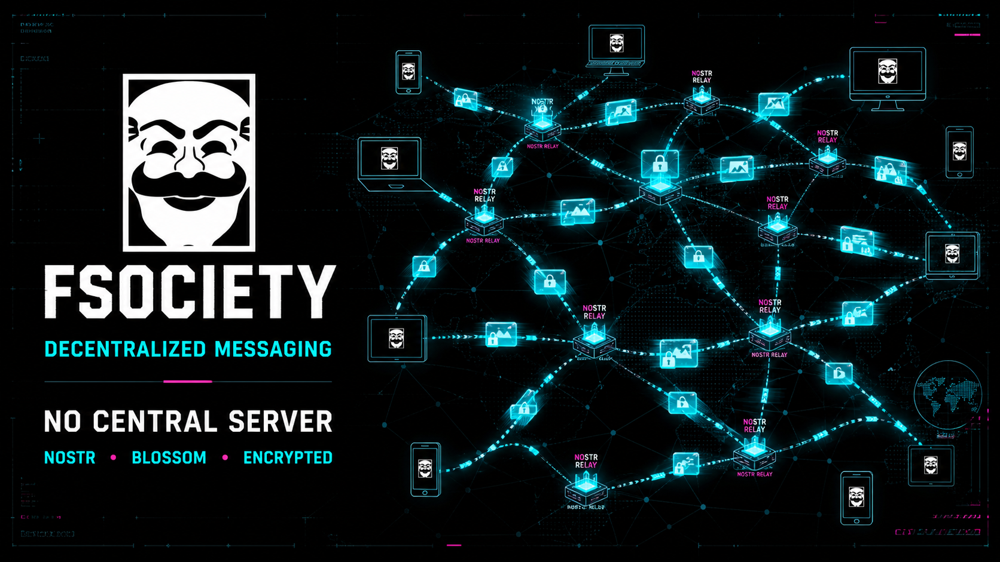
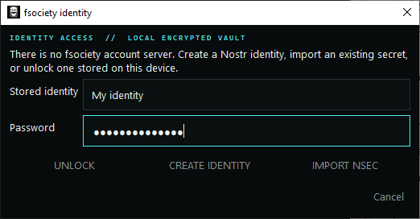
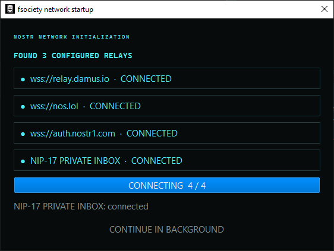
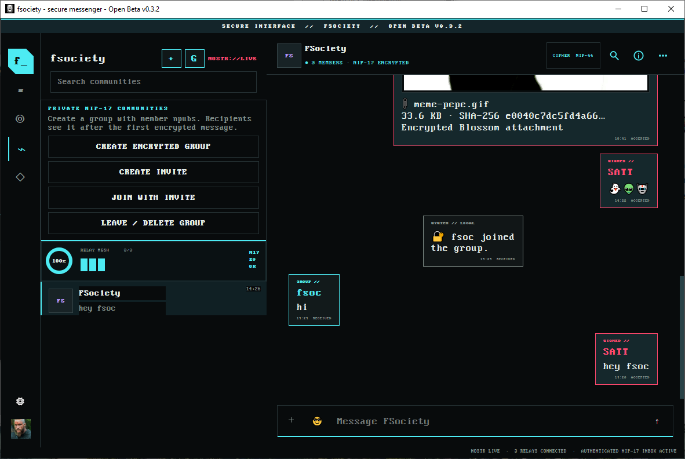
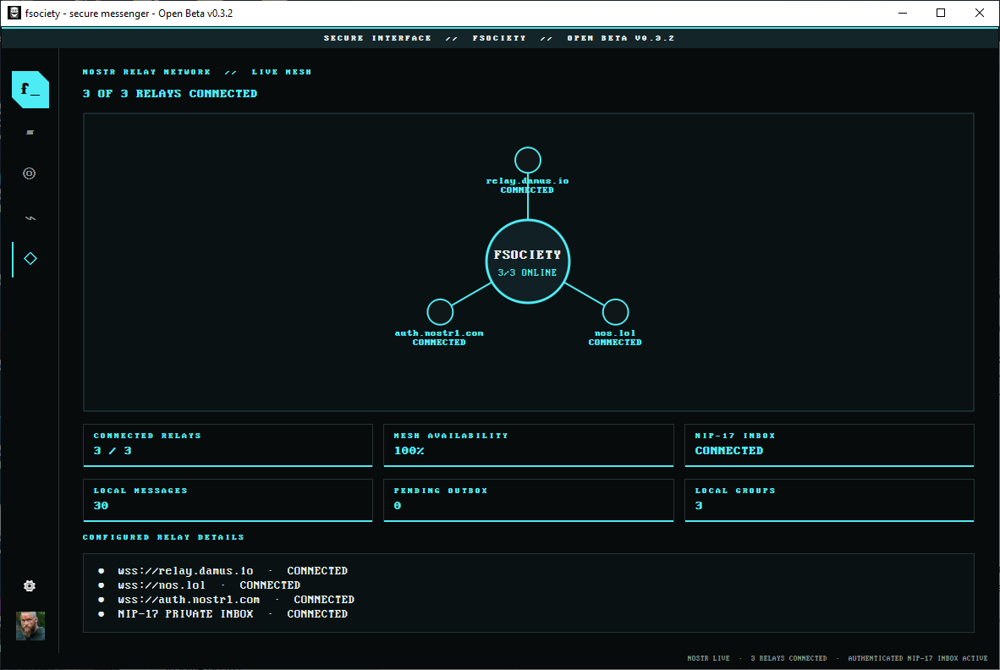

# FSociety secure messenger




**fsociety** is a decentralized desktop messenger built on the
Nostr protocol. It provides encrypted direct messages and private communities,
Nostr identities and profiles, contacts, encrypted file and media
sharing through Blossom, and live relay-health monitoring. Accounts, settings,
message history, and encrypted secrets remain in local SQLite storage; no
central fsociety account server is required. Optional moderation affects only
official fsociety clients and does not delete users or events from Nostr.

The client is portable. All persistent state is stored in the `data` subfolder
beside `main.py` during source runs or beside the packaged executable. This
includes the encrypted identity vault, per-identity SQLite databases, settings,
cached profiles, and downloaded attachments. Moving the complete client folder
moves its local data; deleting `data` resets the client after recovery secrets
have been backed up.

The public Windows and Linux client includes a native PyQt6 interface, encrypted
identity vaults, reconnecting Nostr transport, NIP-17 direct and group messages,
portable per-identity SQLite storage, an offline outbox, conversation search,
contacts, local blocking, media previews, and network-health reporting.
ZIP, RAR, and other generic files are supported as encrypted attachments and
are presented to recipients with an explicit save control rather than being
opened automatically.

For installation and day-to-day operation, see the
[fsociety User Guide](docs/user_guide.md).

## Screenshots

### Identity access



### Nostr network connection



### Group chat example



### Network health



## Identity access

After the splash screen, the client can generate a Nostr identity, import an
existing `nsec`/hex secret, or unlock an identity stored on the device. Secrets
are persisted only as NIP-49 encrypted `ncryptsec` values; the vault password
is local and is never sent to a server.

Creation requires a public username and accepts an optional profile image.
Images are center-cropped and smoothly normalized to an exact 128x128 PNG,
including enlargement of smaller images. On the first successful connection,
the avatar is authenticated and uploaded to the configured Blossom server and
the resulting profile is signed and published to connected Nostr relays.
The complete shareable `npub` can be copied with **Settings > Copy My Public
Key (NPUB)**; users never need to type it manually.
During creation, the backup screen has separate copy buttons for the public
`npub` and private recovery `nsec`. Copying the `nsec` requires a warning
confirmation and clears an unchanged clipboard after 60 seconds.

## Security tips

- Back up the private recovery `nsec` offline before relying on an identity.
  Anyone who obtains that secret controls the identity; fsociety cannot reset
  or recover it.
- You may create a new identity whenever you want to rotate to a newly generated
  keypair. The new `npub` must be shared with every person you want to remain in
  contact with so they can add it and begin a new conversation.
- A new identity is cryptographically separate from every previous identity.
  Its keys cannot decrypt, recover, or inherit old conversations and messages.
  Keep the former identity's `nsec` and portable `data` folder if you need access
  to its history; creating new keys does not transfer that history.
- Back up the complete portable `data` folder regularly. Relay and Blossom
  retention policies are service-specific and must not be treated as a permanent
  backup of messages or attachments.

Contacts can be removed from the Contacts page or their profile without erasing
the corresponding local conversation. Right-click any message and choose
**Hide message locally** to remove it from this identity's view. This local
tombstone prevents relay synchronization from displaying the event again and
cancels a pending retry when the message has not yet been published. It cannot
erase copies already accepted by Nostr relays, received by another participant,
or stored by a Blossom server.

To remove an entire direct chat, open its **More actions** menu and choose
**Delete conversation locally**. This hides its current local history and
cancels queued retries without claiming to erase relay or recipient copies. A
new incoming message or deliberately adding the same `npub` can reopen it.

Use **Block / Unblock Selected User** on the Contacts page, or the equivalent
button in a user's profile, to manage unwanted senders. Blocking immediately
hides that key's existing messages and locally discards its future direct
messages, group messages, attachments, and group-control events. Because NIP-59
hides the real sender from relays, the encrypted wrapper may still reach the
device before fsociety decrypts enough metadata to identify and discard it.
Blocking is local to this identity and does not remove the user from Nostr;
blocked contacts remain visible on the Contacts page with a `[BLOCKED]` label so
they can be unblocked later. Explicitly adding a blocked user's `npub` again also
unblocks that identity and resumes contact.

## Development

### Running the uncompiled source

The uncompiled client requires **Python 3.12 or newer** and the packages in
`requirements.txt`. A compiled fsociety executable already contains its Python
runtime, so end users of a release build do not need to install Python.

Download Python for Windows or source-based installations from the
[official Python downloads page](https://www.python.org/downloads/). On Windows,
enable the installer's option to add Python to `PATH`, then confirm it works with
`python --version`. On Linux, install Python 3 and pip using the distribution's
normal package manager, then confirm it with `python3 --version`.

After Python is available, install the client dependencies from inside the
app folder:

```powershell
python -m pip install -r requirements.txt
```

On Linux the equivalent is usually:

```sh
python3 -m pip install -r requirements.txt
```

On Windows, install and run directly from the `client` folder. No sibling
workspace package is required:

```powershell
python -m pip install -r requirements.txt
.\run.bat
```

Run the client test suite from the same folder with:

```powershell
$env:PYTHONPATH = "src"
python -m unittest discover -s tests -v
```

On Linux, use `PYTHONPATH=src python3 -m unittest discover -s tests -v`.

On Linux, use the matching portable launcher. It uses the existing Python
environment and does not install packages:

```sh
sh run.sh
```

Set `PYTHON_BIN` when a particular interpreter is required, for example
`PYTHON_BIN=python3.14 sh run.sh`.

For auto-py-to-exe, select this folder's `main.py`, **One File**, and
**Window Based** mode. Select `assets/fsociety.ico` as the icon and add the
entire local `assets` folder with destination `assets`. The application shows
the branded `loading...` splash for 2.5 seconds before opening the main window.

## Release builds

Platform-specific packaging lives under `installs/windows` and
`installs/linux`. Neither build script installs packages or changes the system
Python environment. They use the already-installed requirements, read the
version directly from `fsociety_client`, bundle all assets, and produce a
versioned archive plus a SHA-256 checksum under that platform's `dist` folder.

Build the Windows release on 64-bit Windows:

```powershell
.\installs\windows\build.bat
```

Build the Linux release on the Linux architecture being distributed:

```sh
sh installs/linux/build.sh
```

PyInstaller does not cross-compile between Windows and Linux. The Linux package
contains an optional unprivileged `install.sh` and desktop entry; it can also be
run directly without installation. Windows is distributed as a standalone
`fsociety.exe` inside a ZIP archive.

### Source-secret safety check

Every Windows and Linux release build first runs
`scripts/check_source_secrets.py`. This local, read-only check scans text files
inside the public client folder for accidentally committed Nostr `nsec` keys,
encrypted `ncryptsec` vault records, PEM private keys, and developer-specific
absolute home-directory paths. It skips the portable `data` folder and does not
inspect user account databases or personal attachments, connect to the network,
upload data, or install software.

If a possible disclosure is found, the check reports only the affected file and
category—not the secret value—and stops the release build. Run it independently
with:

```powershell
python scripts\check_source_secrets.py
```

A clean tree reports `Source secret check passed.` Binary screenshots and other
non-text assets must still be reviewed manually before publication.

Default beta endpoints are `wss://relay.damus.io` with `wss://nos.lol` as the
general-relay fallback, `wss://auth.nostr1.com` as the NIP-17 DM inbox relay,
and `https://blossom.nostr.build` with `https://blossom.primal.net` as Blossom
storage fallback. Users may replace any endpoint in Settings.
Each endpoint control is an editable picker: choose a listed service or type a
custom `wss://` or `https://` address.

### Find or operate a Nostr relay

- [Nostr.Watch relay directory](https://nostr.watch/relays/find) can be used to
  discover public relays and compare their reported availability.
- [NIP-11 Relay Information Document](https://github.com/nostr-protocol/nips/blob/master/11.md)
  explains the metadata a relay may publish, including supported NIPs, limits,
  authentication, payment requirements, contact details, and terms of service.
- [nostr-rs-relay](https://github.com/scsibug/nostr-rs-relay) and
  [strfry](https://github.com/hoytech/strfry) are open-source relay servers for
  users who want to operate their own infrastructure.

Relay availability, retention, write policies, fees, and supported NIPs vary.
Review a relay's NIP-11 information and operator documentation before using it,
keep multiple independent relays configured where practical, and do not treat a
public relay as a permanent backup. Running a relay also requires normal server
operations such as secure TLS/WebSocket exposure, updates, monitoring, storage,
and backups; entering a custom address in fsociety does not create or administer
the relay.

Paste the moderation authority `npub` from an admin user into
**Settings > Moderation admin key**. The client fetches the latest signed
NIP-51 mute list from the configured general relays, verifies its signature and
author, stores the targets locally, and filters matching user public keys and
post event IDs. This affects only official fsociety views.

The status bar reports actual connection state and relay acknowledgements.
Start a real encrypted conversation with the `+` button beside the fsociety
heading and enter the recipient's `npub`. Failed sends remain in SQLite and are
retried after reconnection.

The client intentionally does not ingest a public Nostr feed. Connection health
is reported by the authenticated NIP-17 inbox and relay acknowledgements instead.
Contact and group-member profiles are resolved directly by public key. The `G`
button creates a private NIP-17 group
whose rumor is individually gift-wrapped for every member. Direct-chat and
group attachments are AES-256-GCM encrypted before authenticated Blossom
upload. Recipients verify the blob hash, decrypt it, and cache it under the
local attachments directory. Supported images and short videos can then be
displayed inline according to the conversation's local media settings.

New groups automatically include the creator and may start with no other
members. Communities provides **Create Invite** and **Join With Invite**.
Invites are valid for 24 hours, signed, and targeted to one recipient npub; damaged,
expired, or wrong-recipient codes are rejected before local membership changes.
Any current member may create an invite. Member-created invites preserve the
original creator key so creator-only group authority remains consistent.

When the creator is the group's only member, there is nobody else for whom the
client can create an encrypted NIP-17 gift wrap. Messages composed in that state
remain visible only in the creator's local database and may be marked **Failed**;
they are not published to relays. After another member joins, newly sent messages
are encrypted and delivered normally. Earlier solo-group messages are not sent
retroactively to the new member, so pre-membership history remains private. Any
unwanted local-only message can be removed with **Hide message locally** from its
right-click menu.

## License

This project is licensed under the [MIT License](LICENSE).
